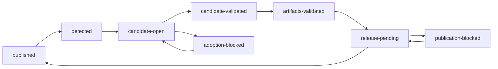

# Agent Note: Transactional upstream adoption and verified desktop publication

Status: proposed

English | [中文](2026-08-31-transactional-upstream-adoption-and-verified-desktop-publication.zh.md)

## Problem

The current [automatic upstream release process](../../implemented/process/2026-08-27-automatic-upstream-desktop-releases.md) merges each queued upstream Release in an ephemeral runner, updates `main` and a desktop tag after source checks, and treats release-workflow dispatch as the end of the adoption run. A real merge conflict therefore has no durable integration branch, while each scheduled poll repeats the same deterministic failure and adds another blocker comment. Source adoption and desktop publication also have different failure boundaries, but one completed-state record cannot represent candidate validation, a pending draft, partial assets, or public-release verification.

The first production acceptance exposed this gap: sixteen scheduled runs attempted the same `dsh-v0.1.2-alpha.1` commit from the same downstream head, all failed on the same conflict set, and never reached Mint packaging. Ordered adoption then correctly held `alpha.2`, but the unchanged blocker still produced repeated Action and Issue notifications. The [incident work item](../../../../docs/work-items/20260831-upstream-mint-release-incident/brief.md) owns the evidence.

The repair must retain automatic clean adoption, immutable versions, unsigned-preview defaults, signed-mode trust requirements, and user-controlled installation. It must not silently choose semantic conflict resolutions or expose repository and Apple credentials to candidate code.

## Proposal

Replace the direct ephemeral sequence with a reconciled delivery state machine. Separate repository-installed `Mint Adoption Controller`, `Mint State Finalizer`, and `Mint Release Publisher` GitHub Apps divide candidate/Issue coordination, authoritative state and source finalization, and Release mutation. Candidate code runs only in read-only jobs without an App token or release secrets. Every public, non-draft upstream `dsh-v*` Release remains ordered by publication time, and only the queue head may be active.

The proposal supersedes the current decision's direct-to-`main` merge, state-on-`main`, dispatch-as-completion, and repeated blocker-comment behavior when implemented. It retains the downstream repository, release ordering, trust-mode mapping, immutable desktop tags, release withdrawal, and installation-consent decisions.

## State and attempt identity

The protected linear branch `automation/upstream-adoption-state` stores `state/upstream-adoption.json`. Only the State Finalizer App may write it; force pushes and deletion are prohibited. Controller and Publisher jobs submit transition requests and evidence but cannot update the ref. A trusted finalizer job validates schema, current ref, monotonic revision, allowed predecessor and successor phases, immutable fields, evidence receipt, and compare-and-swap base before committing any transition. It owns detection and attempt claims, candidate and blocker phase changes, validation and artifact receipts, the atomic `release-pending` transition, publication blockers, and final `published` advancement. Git history is the transition log, while the JSON contains schema version, monotonic revision, upstream repository, last fully published release, and at most one active queue-head delivery.

An active delivery records the pinned upstream tag, commit and publication time; desktop tag and trust mode; phase; candidate branch, PR, base and head commits, validation run and approval requirement; publication run and draft state; current attempt; failure; blocker Issue; and update provenance. The upstream tag and commit are immutable after detection. Moving or deleting that tag is a security blocker rather than a retarget signal.

`lastPublishedRelease` advances only after the public GitHub Release passes post-publication verification. A scheduled run derives a canonical SHA-256 input key from the phase and immutable inputs: adoption uses the upstream tag and commit, current `main`, desktop tag and mode; validation additionally uses the candidate head; publication uses the desktop tag, source commit and mode. A failure fingerprint separately hashes the phase, failed stage, normalized failure class, and sorted conflict paths or failed check names. URLs, timestamps, runner names, and raw logs are excluded.

Merge conflicts, check failures, configuration errors, tag or provenance mismatches, and unknown failures are deterministic blockers. An unchanged scheduled input returns a successful no-op without executing the failed stage or mutating its PR or Issue. Allowlisted API, network, runner, upload, and dispatch interruptions may retry after 30 minutes, two hours, and six hours; exhaustion becomes a deterministic blocker. A changed authoritative input creates one new attempt. Manual force requires the exact queue-head tag and a reason, increments the attempt ordinal once, and never bypasses ordering, approval, checks, signing, artifact verification, or tag immutability.

## Candidate branch and validation

Each queue head owns `automation/adopt/<sanitized-upstream-tag>` and one integration PR. A clean merge creates a real `--no-ff` merge commit on that branch. A conflict aborts the merge and adds `.github/upstream-adoption-requests/<sanitized-upstream-tag>.json`, containing the pinned source, base, target desktop release, state revision, normalized conflict paths, and exact recovery commands. The request file makes the recovery branch and conflict inventory inspectable; the PR cannot display the assembled upstream diff until the maintainer completes the merge. The maintainer fetches the pinned tag, verifies its commit, merges that commit with `--no-ff`, resolves by the ownership classifier, removes the request file, and pushes without force. Validation and finalization reject a candidate while the request file exists or the pinned upstream commit is not an ancestor.

Candidate branches never allow force push. When `main` moves, the bot may merge the new base into a bot-only candidate; a human-authored candidate becomes `candidate-stale` and requires the maintainer to merge current `main`. Any candidate-head change invalidates its validation receipt, artifact bundle, and approval. Conflict resolution or another manual edit requires one maintainer approval whose review commit matches the final validated head. Closing the PR without merging pauses the delivery; scheduled reconciliation cannot recreate it until an explicit resume. The branch remains until publication completes, then the bot deletes it and closes any still-open PR with finalization and publication links.

Candidate creation asks the trusted state-finalizer job to write a single-use validation nonce to protected state, then sends `repository_dispatch`; it does not depend on events created by `GITHUB_TOKEN`. The validator uses its workflow definition from the current default-branch commit, which must equal the candidate base, and receives no App or Apple credentials. A trusted preparation job re-derives the nonce, state revision, input key, PR, branch, current base, pinned upstream, desktop tag and mode before a separate read-only job checks out and executes the exact same-repository candidate head. That job runs the immutable install, desktop tests and build, repository typecheck, documentation sync, generated-drift check, and workflow/state-machine tests including `scripts/desktop-workflows.spec.ts`. `pull_request_target` must never execute candidate code.

A fresh attestation job does not check out or execute the candidate. After every required job succeeds, it creates one immutable Actions artifact containing the receipt schema, single-use nonce, state ref commit and revision, input key, candidate/base/upstream commits, desktop tag and mode, workflow commit, run ID and attempt, conclusion, and artifact-bundle digests. It may project a non-authoritative commit status onto the candidate from this trusted job. The finalizer queries the exact run, downloads this receipt, and requires every field to match current protected state and GitHub data. Missing or expired artifacts, replayed nonces, changed heads, stale revisions, payload-only claims, non-success conclusions, or workflow commits that differ from the current base require revalidation.

## Artifact qualification and secret boundary

All source-dependent packaging completes before the immutable desktop tag exists. The validation run builds and smokes the two native architectures from the candidate commit without repository-write credentials. Unsigned preview produces the final DMGs and checksum input in unprivileged jobs. Signed modes first produce manifest-bound unsigned application payloads without Apple credentials, then pass them to protected signing jobs on fresh runners.

A signing job checks out only the trusted control-plane commit, downloads the exact payload and manifest, rejects escaping links or unexpected files, and invokes fixed system signing, packaging, notarization, and verification commands. The pre-sign manifest binds archive digest, source commit, architecture, and every member's normalized path, type, mode, size or digest, or symlink target. Trusted extraction rejects duplicates, hard links, special files, absent parents, and root escapes before materializing regular files without following links. It does not run candidate package installation, package scripts, Electron Builder configuration or hooks, application code, or another candidate-controlled executable while Apple credentials are present. The resulting immutable Actions bundle records artifact IDs, names, SHA-256 digests, architecture, trust mode, source commit, validator workflow and run, and retention. Publication consumes this bundle without rebuilding.

Changes to controller, validator, finalizer, publication, signing, state-schema, ownership-classifier, ruleset-manifest, or workflow files are protected control-plane changes. Even a clean bot merge touching one requires maintainer approval on the exact candidate head; the finalizer compares the protected-path diff and rejects missing or stale approval.

## Atomic source finalization

The finalizer receives a short-lived Finalizer App token but executes no candidate code. It rechecks active rulesets and App permissions, the state revision, exact candidate and base commits, upstream tag binding, validation receipt and artifact bundle, protected-path and human-edit approvals, and absence of the desktop tag and request file. It prepares a fast-forward of `main` to the artifact-qualified candidate, an annotated desktop tag pointing to that candidate, and a state-branch commit entering `release-pending` with the exact bundle receipt. One `git push --atomic` creates all three ref updates without force. Any concurrent change rejects the complete push.

The State Finalizer App is the only automation actor allowed an always-bypass entry on the `main` PR ruleset, and its private key exists only in a protected finalizer environment. One `desktop-v*` tag ruleset restricts creation with only the State Finalizer App and maintainer role as bypass actors; a separate ruleset prohibits updates and deletion without any bypass. The state branch requires one non-stale approval and squash-only PRs for every non-bypass writer, while only the State Finalizer App has an automation bypass; it also prohibits deletion and non-fast-forward updates. Candidate branches prohibit deletion and non-fast-forward updates while active. If GitHub does not automatically mark the PR complete when its head becomes reachable from `main`, the controller closes it with the exact finalizer commit and run.

## Draft-first publication

Publication is a separate recoverable phase because Git refs and GitHub Releases cannot share a transaction. The controller explicitly dispatches the release workflow. Automatic validation and publication runs upload a small attempt-context artifact that binds run ID, state-ref commit and revision, input key, and candidate or release identity; the observer ignores failed or successful runs that do not match the current protected attempt exactly. An unprivileged job downloads the exact artifact bundle and validation receipt named in protected state, verifies the originating completed run and every digest without rebuilding, and binds exceptional manual tags to the same qualification receipt. A separate trusted publication job receives the Publisher App token but no Apple credential, finalizer credential, `main` bypass, or candidate checkout; it creates or reuses a draft, reconciles the exact asset set, writes notes and checksums from protected state, downloads the draft for verification, and publishes it. Only after that workflow itself completes successfully does the independent observer dispatch cursor advancement. The Finalizer downloads the public assets, rechecks their digests, notes, visibility, source tag, mode, and Latest status, then advances state. Dispatch, tag existence, Release existence, or an in-progress publishing job alone never means complete.

Unsigned and signed previews require arm64 and x64 DMGs plus `SHA256SUMS.txt`. Signed stable releases additionally require both ZIPs and blockmaps plus `latest-mac.yml`. Verification binds asset names and cardinality, downloaded checksums, tag-to-source commit, release mode and visibility, and notes containing the upstream tag, upstream commit, desktop source commit, and mode. Existing signature, notarization, and update-metadata checks remain mandatory in signed modes; unsigned preview receives no Apple secrets.

A valid public Release with pending state advances without rebuilding. A valid draft resumes at publish, while an incomplete matching draft may reconcile exact assets from the bound bundle before verification. If that bundle expires before publication, the same immutable source may be requalified into a new receipt; a source change invalidates the candidate before tag creation and starts validation again. An incomplete or mismatched public Release is never overwritten or deleted automatically; the delivery blocks until the existing withdrawal and recovery process makes it safe. The queue advances only after the public post-check and compare-and-swap state update.

Exceptional manual desktop-only releases remain outside the upstream queue. A maintainer may create a new semantic `desktop-v*` tag, never update or delete it, and the same isolated build/sign/publish boundary creates a draft rather than an automatic public Release. A deterministic defect after manual tag creation requires a new version and tag; the failed immutable tag remains unpublished evidence.

## Blocker and notification lifecycle

At most one Issue is open for the queue head: `Blocked: deliver DeepSeek Harness <upstream-tag>`. Its body projects the authoritative phase, upstream and desktop provenance, integration PR, last meaningful run, input key and fingerprint, conflict or asset summary, queued followers, and one recovery action. State remains authoritative.

The first blocker creates the Issue. Adoption recovery followed by publication failure reuses it by replacing the stable body rather than appending comments. Identical scheduled input does not retry, edit, or comment. Issue mutation occurs only for a changed phase or fingerprint and verified recovery; the Issue closes only after public verification and cursor advancement. If a trusted observer cannot durably record a queue-head blocker, it disables the schedule and asks the Controller to create one circuit-breaker Issue. The observer does not observe its own runs or failed Controller projection runs, so fallback reporting cannot recurse.

## Conflict ownership

A versioned classifier groups conflicts and selects instructions but never applies blanket `ours` or `theirs`. Generated catalogs and regions are rebuilt from their owning declarations or templates. Bilingual prose is resolved in both authored languages; `*.i18n.yaml` is never hand-merged and is re-recorded after the pair is consistent. Lockfiles, notices, and other derived artifacts are regenerated from authoritative manifests or sources. Mint branding, desktop workflows, product overlays, and downstream guards are consciously reapplied over the upstream version. Shared runtime and configuration files require line-by-line review and relevant tests. Unclassified paths default to shared manual review.

## Identity and trust

The repository-installed Controller App has Contents, Workflows, Pull requests, Issues, Actions, and Commit statuses read/write permissions. It may update candidate refs under active rulesets and has no state or `main` bypass. The State Finalizer App has Contents, Workflows, and Actions read/write permissions, is the sole state writer, and holds the narrow `main` bypass; its runtime private key exists only in the protected finalizer environment after transient bootstrap copies are deleted. The Publisher App has Contents read/write permission for GitHub Release objects, no branch or tag bypass, and a runtime private key only in the protected publication environment after bootstrap. No PAT is used. Candidate and unprivileged build jobs receive read-only access and no secrets. Dispatch fields are hints: trusted jobs re-derive identifiers from protected state, immutable receipts, and GitHub data. Fork PRs, comments, arbitrary branches, and candidate-edited workflows cannot invoke attestation, state transition, finalization, or publication.

The maintainer is the ruleset and App administrator. Runtime Apps receive neither Administration nor Environments permission: GitHub hides ruleset bypass actors without ruleset write authority, and an audit credential able to edit the policy it checks would invalidate least privilege. Hidden administrative metadata is instead authenticated by `.github/release-policy/activation.json` and a detached, maintainer-signed policy receipt. The owner-authenticated activation record pins the repository ID, personal owner login and type, activation PR and rotation ordinal, receipt signer identity, SSH public key and fingerprint, and the prior activation during rotation. It never names the commit that contains itself or a renewable receipt. The repository-owner bootstrap authority and protocol are durable; the production signer key is supplied only at activation. Until activation verifies, discovery and candidate validation may run, but source finalization, tag creation, and publication fail closed.

`.github/release-policy/receipt.json` records schema and receipt IDs, a globally monotonic sequence, its authorization PR, repository identity, issue and expiry times of at most 30 days, the exact prior receipt ID and derived bundle digest, every ruleset's ID, name, target, enforcement, conditions, rules, `updated_at`, and administrator-observed bypass actors, the three App slugs, IDs, installation IDs, and permissions, protected environment IDs, names, protections, expected secret names, protected workflow digests, and generator version. The offline generator combines an administrator-scoped repository token with operator-held App private-key paths outside the repository: it uses each key only to mint a short-lived local JWT that proves the configured App identity, installation, permissions, and repository access. It never stores key material in the config or receipt, uploads it, or reads GitHub secret values; transient bootstrap copies are deleted after generation, and renewal may use separate temporary App keys. `ssh-keygen -Y sign` signs the exact receipt bytes under namespace `dsh-mint-release-policy-v1`; `.github/release-policy/receipt.json.sig` and the activation-pinned public key permit deterministic verification. A temporary `allowed-signers` input is derived from activation rather than stored as a fourth trust file. The receipt-bundle SHA-256 input is ASCII domain `dsh-mint-release-policy-receipt-bundle`, one NUL byte, unsigned 32-bit big-endian version `1`, then exactly receipt followed by signature; each entry is unsigned 32-bit big-endian UTF-8 path length, path bytes, unsigned 64-bit big-endian content length, and unmodified file bytes. The digest is stored only in protected state, not inside the current receipt.

Activation and receipt authorization use squash merge exclusively. Runtime requires the recorded PR to target `main` from the same repository, be merged by the current personal repository owner, and have a non-null reachable merge SHA distinct from the PR head SHA whose GitHub commit verification is `valid`, committer identity is `web-flow`, parent count is one, tree equals the PR head tree, and parent-to-commit diff equals the complete paginated PR file list. A behind-base tree, merge commit, rebase, fast-forward, fork, external close, truncation, rename, deletion, or indeterminate shape is rejected. The merged-PR record authenticates owner authorization; GitHub commit verification authenticates platform commit integrity, not owner identity.

Initial activation changes exactly activation, receipt, and signature; its receipt has sequence one, no predecessor, and the activation PR as its authorization. Current activation bytes must thereafter equal the activation squash commit. A renewal changes exactly receipt and signature, leaves activation untouched, increments sequence by one, names its own authorization PR, and links the prior receipt ID and bundle digest from protected state. Current receipt bytes must equal their initial or renewal squash commit. Protected state separately stores activation rotation, PR, derived commit, activation digest and signer fingerprint, plus current receipt sequence, ID, bundle digest, authorization PR, derived commit and expiry. It rejects skipped or lower sequence, same-sequence replacement, predecessor mismatch, and repository contents beyond the single permitted next sequence. Only one renewal may be pending.

Before every atomic finalization, a trusted preflight verifies the owner-authorized activation and current receipt PRs, both derived commits and exact current bytes, receipt chain and signature, repository owner and ID, schema, times, digest, signer identity, executing App slug, ID, installation and granted permissions, current state ref, and protected workflow digests. Each trusted policy-verification step derives an in-memory, short-lived App JWT from the same App ID and private-key secret used to mint its installation token, queries the repository-installation endpoint with that JWT, and rejects a configured App ID that does not own the returned installation; the private key and JWT are never written to disk or output. The installation token remains the credential for repository operations. It queries each recorded ruleset and compares every runtime-visible ID, target, enforcement, condition, rule, and `updated_at` value exactly. Later unrelated commits are allowed only while both derived commits remain ancestors. Restoring current authorized bytes is allowed only while sequence, ID, digest, PR, derived commit and protected state agree; copying an older receipt is rejected. The signed bypass list is the authenticated hidden-field observation; any ruleset edit changes `updated_at` and invalidates the receipt. If GitHub stops exposing a recorded field or timestamp, preflight fails closed. A missing, expired, or drifting receipt is the deterministic `policy-drift` blocker and receives no scheduled retry.

Signed publication statically permits exactly the five attested Apple secret references, proves unsigned jobs reference none, materializes only those names in the protected signing job, and requires each value to be non-empty and usable through certificate, API, signature, and notarization checks without printing it. A missing expected secret blocks signed publication but not unsigned-preview publication; all publication still requires an active policy receipt. Additional unreferenced environment secrets do not enter job authority. Renew the receipt through its monotonic squash-PR chain before expiry and after any ruleset, bypass actor, App installation or permission, environment protection or secret-name, or protected workflow change. Signer rotation increments activation, proves the new key, directly links protected activation and receipt state, and preserves global receipt sequence. The prior key signs the canonical rotation statement under namespace `dsh-mint-release-policy-rotation-v1`; loss of that key is break-glass work requiring a reviewed decision amendment. Any repository ownership transfer, including transfer to an organization, invalidates activation and requires a fresh reviewed bootstrap amendment rather than routine rotation.

The existing policy continues to trust a pinned public upstream Release as source input for the product. Signed release secrets remain limited to the protected release jobs and are never present during adoption validation. Logs, Issue text, and fingerprints exclude credentials, personal paths, and raw unbounded output.

## Migration

Land the controller, validator, artifact qualifier, isolated signer, finalizer, publication verifier, schema validator, ruleset and App manifests, and policy-receipt verifier while the current v1 file remains read-only and the legacy scheduler is paused. The maintainer creates the Apps and separate protected environments, activates the rulesets, introduces the owner-authenticated activation record and initial signed receipt, then runs a zero-mutation preflight. Seed the protected state branch from `.github/upstream-sync-state.json` only after verifying the recorded desktop tag and public Release; a historical baseline may be marked legacy-verified when it predates the new asset contract. Once the state ref exists, stop reading v1 state and enable only the new controller. The first production adoption records the receipt ID and digest, verify-only run, activation PR and commit, and applicable signing smoke as acceptance evidence.

Preserve Issue 25 as the single `alpha.1` blocker. The redesign changes `main`, so create one new `alpha.1` attempt against the post-redesign base, resolve and publish it, and only then expose `alpha.2`. The sixteen old runs remain incident evidence rather than retry ordinals. Migration never manually advances the cursor, substitutes a tag, or skips `alpha.1`.

## Alternatives considered

**Keep ephemeral merging and add only backoff.** This is smaller but leaves conflicts runner-local and cannot represent validation or publication recovery precisely.

**Require a human PR for every Release.** This maximizes routine review but removes the accepted automatic path for clean upstream releases.

**Use one or two Apps, a PAT, or `GITHUB_TOKEN` PR events.** One App cannot prevent its controller or publication token from exercising the finalizer's ruleset bypass; combining finalization and publication has the same defect. A PAT is a long-lived person-shaped credential, while `GITHUB_TOKEN`-created events are not a reliable trigger or branch-rule identity. Three purpose-specific Apps, protected environments, and explicit dispatch give enforceable credential and audit boundaries.

**Give Finalizer or a fourth Auditor App Administration write.** That permission is required for complete live bypass-actor reads, but it also lets the credential alter the policy it audits. A signed, expiring administrator observation plus runtime-visible drift checks retains three least-privilege runtime identities without self-auditing authority.

**Store in-flight state in Issues or on `main`.** Issues are weakly typed and noisy to mutate; state commits on `main` change their own adoption base. A protected ref supplies schema validation and compare-and-swap updates without product-source churn.

**Publish directly or overwrite partial public Releases.** Direct publication exposes partial assets, while overwrite hides provenance disagreement. Draft-first reconciliation keeps incomplete work private and makes a public mismatch an explicit withdrawal decision.

**Automatically choose `ours` or `theirs`.** Path ownership does not prove semantic correctness. Classification may explain recovery, but ambiguous content remains a maintainer decision.

## Acceptance criteria

- Only the oldest unpublished upstream Release can become active; manual input cannot skip it or retarget a moved tag.
- A clean release creates one PR, validates and qualifies both architectures before tag creation, and finalizes `main`, desktop tag, and state atomically; a conflict creates one recovery request PR and requires the documented exact merge, request removal, revalidation, and exact-head approval.
- Identical deterministic scheduled failures become successful no-ops with no PR or Issue mutation; transient retries are bounded, and force retains every safety gate.
- Source finalization or publication interruption is recoverable from protected state without moving a tag, rebuilding a valid public Release, or advancing the queue early.
- Publication becomes complete only after expected assets, checksums, visibility, release mode, provenance, and signed-mode requirements pass a public post-check.
- One queue-head blocker spans adoption and publication and produces notifications only on meaningful transitions.
- Validation produces an immutable, single-use receipt bound to the exact state, input, candidate, workflow and successful run; stale, replayed, missing, or payload-only claims cannot finalize.
- Candidate execution, secret-bearing signing, ref finalization, and Release mutation use separate jobs and credential boundaries; protected control-plane changes always require exact-head approval.
- Exceptional manual desktop-only tags remain immutable and draft-only, while automatic source defects are discovered before tag creation.
- Every irreversible transition requires an owner-authenticated activation record and an unexpired signed policy receipt whose runtime-visible ruleset fields, App identity, workflow digests, and repository identity still match; unconfigured, expired, or drifting policy fails closed.
- Scenario tests cover ordering, conflict lifecycle, candidate changes, stale bases, approval invalidation, receipt replay, ruleset and permission preflight, atomic rejection, artifact qualification, secret isolation, duplicate triggers, deterministic and transient failures, force, drafts, partial or mismatched public Releases, trust modes, malformed state, manual tags, and the next real upstream Release.

## Risks

The three Apps, protected environments and state branch, repository dispatch, rulesets, signed policy receipts, artifact handoff, and additional workflows increase setup and test surface. A misconfigured bypass could weaken ordinary `main` protection, so activation requires owner-authenticated attestation and production acceptance must exercise cross-identity permission denial, policy drift and expiry, receipt replay, protected-path approval, and concurrent-ref rejection.

The state branch is another durable recovery surface. Schema validation, linear history, compare-and-swap revision, backup through Git, and explicit malformed-state recovery are required. The bot must not force-repair it.

Clean adoption remains automatic and therefore retains the existing decision to trust pinned upstream Releases plus automated checks without per-version human review. Protected-path changes and signed-mode secret use require the current trust controls; this proposal does not claim that automation can prove an upstream maintainer's intent.
