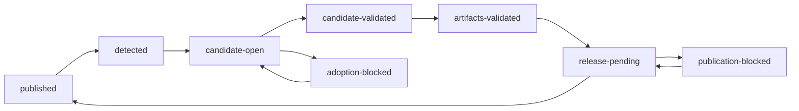

# Agent Note: 事务化上游采纳与经验证的桌面发布

Status: proposed

[English](2026-08-31-transactional-upstream-adoption-and-verified-desktop-publication.md) | 中文

## 问题

当前的[上游自动发布流程](../../implemented/process/2026-08-27-automatic-upstream-desktop-releases.zh.md)在临时 runner 中合并每个排队的上游 Release，通过源码检查后更新 `main` 和 desktop tag，并把分发 release workflow 当作采纳 run 的终点。因此，真实合并冲突没有持久 integration branch，而每次定时轮询都会重复相同的确定性失败并新增 blocker 评论。源码采纳与桌面发布具有不同的失败边界，但单一完成状态记录无法表达候选验证、待处理 draft、部分资产或公开 Release 验证。

第一次生产验收暴露了这个缺口：16 次定时 run 从同一下游 head 尝试同一个 `dsh-v0.1.2-alpha.1` commit，全部在同一组冲突上失败，从未到达 Mint 打包。有序采纳随后正确地阻挡了 `alpha.2`，但未变化的 blocker 仍产生重复的 Action 与 Issue 通知。[事故工作项](../../../../docs/work-items/20260831-upstream-mint-release-incident/brief.zh.md)归属这些证据。

修复必须保留干净采纳的自动化、不可变版本、无签名预览默认值、signed 模式信任要求以及用户控制安装。它不得静默选择语义冲突的解决结果，也不得向候选代码暴露仓库或 Apple 凭据。

## 提案

用可协调的交付状态机替换直接的临时序列。仓库分别安装 `Mint Adoption Controller`、`Mint State Finalizer` 与 `Mint Release Publisher` GitHub App，把候选和 Issue 协调、权威状态和源码 finalization、Release mutation 分开。候选代码只能在没有 App token 或发布 secret 的只读 job 中运行。每个公开且非 draft 的上游 `dsh-v*` Release 继续按发布时间排序，并且只有队首可以处于 active 状态。

本提案实施后将取代当前决策中的直接合并到 `main`、在 `main` 上保存状态、以 dispatch 作为完成以及重复 blocker 评论的行为。它保留下游仓库、发布顺序、信任模式映射、不可变 desktop tag、Release 撤回和安装同意决策。

## 状态与 attempt identity

受保护的线性分支 `automation/upstream-adoption-state` 保存 `state/upstream-adoption.json`。只有 State Finalizer App 可以写入；禁止 force push 和删除。Controller 与 Publisher job 只能提交转换请求与证据，不能更新该 ref。受信任 finalizer job 在提交任何转换前验证 schema、当前 ref、单调递增 revision、允许的前后 phase、不可变字段、evidence receipt 与 compare-and-swap base。它归属 detection 与 attempt claim、candidate 与 blocker phase 变化、validation 与 artifact receipt、原子 `release-pending` 转换、publication blocker 以及最终 `published` 推进。Git 历史是状态转换日志，JSON 则包含 schema 版本、单调递增 revision、上游仓库、最后一个完整发布的 Release，以及至多一个 active 队首交付。

active 交付记录固定的上游 tag、commit 与发布时间；desktop tag 和信任模式；phase；候选 branch、PR、base 与 head commit、验证 run 和 approval 要求；发布 run 与 draft 状态；当前 attempt；failure；blocker Issue；以及更新 provenance。上游 tag 和 commit 在 detected 后不可更改。tag 被移动或删除属于安全 blocker，而不是 retarget 信号。

只有公开 GitHub Release 通过发布后验证，`lastPublishedRelease` 才会推进。定时 run 根据 phase 与不可变输入派生规范化 SHA-256 input key：采纳使用上游 tag 和 commit、当前 `main`、desktop tag 与模式；验证还包含候选 head；发布使用 desktop tag、source commit 与模式。failure fingerprint 则分别哈希 phase、失败 stage、归一化失败类别，以及排序后的冲突路径或失败检查名称。URL、时间戳、runner 名称与原始日志不参与哈希。

合并冲突、检查失败、配置错误、tag 或 provenance 不匹配以及未知失败都是确定性 blocker。输入未变化的定时 run 成功 no-op，不执行失败阶段，也不改变 PR 或 Issue。allowlist 中的 API、网络、runner、upload 和 dispatch 中断可以在 30 分钟、2 小时与 6 小时后重试；用尽次数后成为确定性 blocker。权威输入变化只产生一次新 attempt。手工 force 需要准确的队首 tag 与原因，只把 attempt ordinal 增加一次，绝不绕过顺序、approval、检查、签名、制品验证或 tag 不可变性。

## 候选分支与验证

每个队首拥有 `automation/adopt/<sanitized-upstream-tag>` 和一个 integration PR。干净合并在该分支创建真实的 `--no-ff` merge commit。发生冲突时中止合并，并新增 `.github/upstream-adoption-requests/<sanitized-upstream-tag>.json`，其中包含固定源码、base、目标 desktop Release、state revision、归一化冲突路径与准确恢复命令。request 文件使恢复分支与冲突清单可以检出；在维护者完成合并前，PR 不能展示组装后的上游 diff。维护者 fetch 固定 tag、验证其 commit、用 `--no-ff` 合并该 commit、按照所有权 classifier 解决冲突、删除 request 文件并在不 force 的情况下 push。request 文件仍存在或固定 upstream commit 不是 ancestor 时，验证和 finalization 都必须拒绝候选。

候选分支永远不允许 force push。`main` 移动时，bot 可以把新 base 合并进纯 bot 候选；人工编写的候选进入 `candidate-stale`，要求维护者合入当前 `main`。任何候选 head 变化都会使 validation receipt、artifact bundle 与 approval 失效。冲突解决或其他人工编辑需要一次 maintainer approval，且 review commit 必须匹配最终已验证 head。PR 未合并而被关闭会暂停交付；显式 resume 之前，定时 reconcile 不得重建。分支保留到发布完成，随后 bot 删除分支，并用 finalization 与发布链接关闭任何仍打开的 PR。

候选创建先请求受信任 state-finalizer job 向受保护状态写入一次性 validation nonce，再显式发送 `repository_dispatch`，不依赖由 `GITHUB_TOKEN` 创建的事件。validator 使用当前默认分支 commit 中的 workflow 定义，该 commit 必须等于候选 base，并且不拥有 App 或 Apple 凭据。受信任 preparation job 重新派生 nonce、state revision、input key、PR、branch、当前 base、固定 upstream、desktop tag 与模式，然后由独立只读 job 检出并执行准确的同仓库候选 head。该 job 运行 immutable install、desktop 测试与构建、仓库 typecheck、documentation sync、generated drift 检查，以及包含 `scripts/desktop-workflows.spec.ts` 的 workflow/state-machine 测试。`pull_request_target` 绝不能执行候选代码。

新的 attestation job 不检出或执行候选。所有 required job 成功后，它创建一个不可变 Actions artifact，其中包含 receipt schema、一次性 nonce、state ref commit 与 revision、input key、candidate/base/upstream commit、desktop tag 与模式、workflow commit、run ID 与 attempt、conclusion 以及 artifact-bundle digest。它可以从该受信任 job 向候选投影一个非权威 commit status。finalizer 查询准确 run、下载该 receipt，并要求每个字段匹配当前受保护状态与 GitHub 数据。artifact 缺失或过期、nonce 重放、head 变化、revision stale、只来自 payload 的声明、非成功 conclusion 或不同于当前 base 的 workflow commit，都必须重新验证。

## 制品 qualification 与 secret 边界

所有依赖源码的打包都在不可变 desktop tag 创建前完成。validation run 从 candidate commit 构建并 smoke 两个 native 架构，且没有仓库写凭据。unsigned preview 在非特权 job 中产出最终 DMG 与 checksum 输入。signed 模式先在没有 Apple 凭据的情况下生成受 manifest 约束的 unsigned application payload，再把它们交给全新 runner 上的受保护 signing job。

signing job 只检出受信任 control-plane commit，下载准确 payload 与 manifest，拒绝逃逸 link 或意外文件，并调用固定的系统 signing、packaging、notarization 与 verification 命令。pre-sign manifest 绑定 archive digest、source commit、architecture，以及每个 member 的 normalized path、type、mode、size 或 digest、或 symlink target。trusted extraction 在 materialize regular file 前拒绝 duplicate、hard link、special file、缺失 parent 与 root escape，且不会跟随 link。Apple 凭据存在时，它不运行候选 package installation、package script、Electron Builder configuration 或 hook、application code，也不运行其他候选控制的 executable。最终不可变 Actions bundle 记录 artifact ID、名称、SHA-256 digest、架构、信任模式、source commit、validator workflow 与 run 以及 retention。发布直接消费该 bundle，不重新构建。

controller、validator、finalizer、publication、signing、state schema、ownership classifier、ruleset manifest 或 workflow 文件的变化都属于受保护 control-plane change。即使纯 bot 的干净合并触及其中之一，也必须对准确候选 head 获得 maintainer approval；finalizer 比较受保护路径 diff，并拒绝缺失或 stale 的 approval。

## 原子源码 finalization

finalizer 获得短期 Finalizer App token，但不执行候选代码。它重新检查 active ruleset 与 App permission、state revision、准确的候选和 base commit、upstream tag 绑定、validation receipt 与 artifact bundle、受保护路径及人工编辑 approval，以及 desktop tag 和 request 文件均不存在。它准备把 `main` fast-forward 到已完成制品 qualification 的候选、创建指向该候选的 annotated desktop tag，并创建进入 `release-pending` 且记录准确 bundle receipt 的状态分支 commit。一次无 force 的 `git push --atomic` 创建全部三个 ref 更新；任何并发变化都会拒绝整个 push。

State Finalizer App 是唯一在 `main` PR ruleset 中拥有 always-bypass 的自动化 actor，其 private key 只存在于受保护 finalizer environment。一个 `desktop-v*` tag ruleset 限制创建，并只把 State Finalizer App 与 maintainer role 设为 bypass actor；另一个 ruleset 禁止更新和删除且不给任何 actor bypass。状态分支要求所有非 bypass writer 通过只允许 squash、具备一次非 stale approval 的 PR，而自动化 bypass 只授予 State Finalizer App；它还禁止删除和 non-fast-forward 更新。active 候选分支禁止删除和 non-fast-forward 更新。如果候选 head 可以从 `main` 到达后 GitHub 没有自动把 PR 标记为完成，controller 会用准确 finalizer commit 与 run 关闭它。

## Draft-first 发布

发布是独立的可恢复阶段，因为 Git ref 与 GitHub Release 无法共享同一事务。controller 显式分发 release workflow。automatic validation 与 publication run 上传小型 attempt-context artifact，绑定 run ID、state-ref commit 与 revision、input key，以及 candidate 或 release identity；observer 忽略不能与当前 protected attempt 准确匹配的失败或成功 run。非特权 job 下载受保护状态指定的准确 artifact bundle 与 validation receipt，在不重建的情况下验证来源已完成 run 和每个 digest，并把例外手工 tag 绑定到同一 qualification receipt。独立受信任 publication job 获得 Publisher App token，但没有 Apple credential、finalizer credential、`main` bypass 或候选 checkout；它创建或复用 draft，协调准确资产集，从受保护状态写入 notes 与 checksums，下载 draft 进行验证后公开。只有该 workflow 本身成功结束，独立 observer 才会分发 cursor advancement。Finalizer 下载公开 asset，重新校验 digest、notes、visibility、source tag、mode 与 Latest 状态，再推进状态。仅有 dispatch、tag、Release 或仍在执行的 publication job 都绝不代表完成。

无签名和已签名 preview 都需要 arm64、x64 DMG 与 `SHA256SUMS.txt`。signed stable Release 还需要两个 ZIP、两个 blockmap 和 `latest-mac.yml`。验证绑定资产名称与数量、下载后的 checksum、tag 到 source commit、Release 模式与可见性，以及包含准确 upstream tag、upstream commit、desktop source commit 和模式的 notes。signed 模式继续强制现有签名、notarization 与 update metadata 检查；无签名 preview 不会获得 Apple secret。

公开 Release 有效而状态仍 pending 时，不重新构建即可推进。有效 draft 从 publish 恢复，不完整但匹配的 draft 可以在验证前从绑定 bundle 协调准确资产。如果该 bundle 在发布前过期，同一不可变源码可以重新 qualification 并生成新 receipt；源码变化则会在 tag 创建前使候选失效，并重新开始验证。不完整或不匹配的公开 Release 绝不会被自动覆盖或删除；交付保持阻塞，直到现有 withdrawal 与恢复流程把它变为安全状态。只有公开 post-check 和 compare-and-swap 状态更新完成后，队列才会推进。

例外的手工 desktop-only Release 继续位于上游队列之外。维护者可以创建新的 semantic `desktop-v*` tag，但绝不能更新或删除；同样的隔离 build/sign/publish 边界会创建 draft，而不是自动 public Release。手工 tag 创建后若出现确定性缺陷，需要新的版本与 tag；失败的不可变 tag 作为未发布证据保留。

## Blocker 与通知生命周期

队首至多打开一个 Issue：`Blocked: deliver DeepSeek Harness <upstream-tag>`。其正文投影权威 phase、上下游 provenance、integration PR、最近一次有意义的 run、input key 与 fingerprint、冲突或资产摘要、后续队列以及唯一恢复动作。状态本身仍是权威来源。

第一次 blocker 创建 Issue。采纳恢复后若发布失败，复用该 Issue，并替换稳定正文而不是追加评论。相同定时输入不重试、不编辑、不评论。只有 phase 或 fingerprint 变化以及已验证恢复才会修改 Issue；只有公开验证与 cursor 推进后才关闭 Issue。如果受信任 observer 无法持久记录队首 blocker，它会停用 schedule，并要求 Controller 创建一个熔断 Issue。observer 不观察自己的 run，也不观察失败的 Controller projection run，因此 fallback 报告不会递归。

## 冲突所有权

版本控制的 classifier 对冲突分组并选择说明，但绝不统一应用 `ours` 或 `theirs`。generated catalog 与 region 从归属 declaration 或 template 重建。双语 prose 在两份 authored language 中完成解决；`*.i18n.yaml` 绝不手工合并，而是在 pair 一致后重新记录。lockfile、notices 和其他 derivative artifact 从权威 manifest 或 source 重新生成。Mint branding、desktop workflow、product overlay 与 downstream guard 在上游版本上有意识地重新应用。共享 runtime 和 configuration 文件需要逐行评审以及相关测试。未分类路径默认为共享人工评审。

## 身份与信任

仓库安装的 Controller App 拥有 Contents、Workflows、Pull requests、Issues、Actions 和 Commit statuses read/write 权限。它只能在 active ruleset 下更新 candidate ref，没有 state 或 `main` bypass。State Finalizer App 拥有 Contents、Workflows 和 Actions read/write 权限，是唯一状态 writer，并具有 narrow `main` bypass；临时 bootstrap 副本删除后，其 runtime private key 只存在于受保护 finalizer environment。Publisher App 对 GitHub Release object 拥有 Contents read/write 权限，没有 branch 或 tag bypass，bootstrap 后 runtime private key 只存在于受保护 publication environment。不使用 PAT。候选与非特权 build job 只有只读权限且没有 secret。dispatch 字段只是提示：受信任 job 从受保护状态、不可变 receipt 与 GitHub 数据重新派生标识。fork PR、评论、任意 branch 和候选编辑的 workflow 都不能触发 attestation、state transition、finalization 或 publication。

维护者是 ruleset 与 App 管理员。runtime App 不获得 Administration 或 Environments permission：GitHub 在调用者没有 ruleset write authority 时隐藏 bypass actor，而能够编辑被审计政策的 audit credential 会破坏 least privilege。隐藏的管理元数据改由 `.github/release-policy/activation.json` 与 detached maintainer-signed policy receipt 认证。owner-authenticated activation record 固定 repository ID、个人 owner login 与 type、activation PR 与 rotation ordinal、receipt signer identity、SSH public key 与 fingerprint，以及 rotation 时的 prior activation；它绝不命名包含自身的 commit 或可续期 receipt。repository-owner bootstrap authority 与 protocol 是持久边界；production signer key 只在 activation 时提供。activation 验证前可以运行 discovery 与 candidate validation，但 source finalization、tag creation 与 publication 全部 fail closed。

`.github/release-policy/receipt.json` 记录 schema 与 receipt ID、全局单调 sequence、authorization PR、repository identity、最长 30 天的签发与过期时间、准确 prior receipt ID 与 derived bundle digest、每个 ruleset 的 ID、name、target、enforcement、conditions、rules、`updated_at` 与管理员观察到的 bypass actor，三个 App 的 slug、ID、installation ID 与 permission，protected environment 的 ID、name、protection 与预期 secret name，protected workflow digest 以及 generator version。offline generator 把 administrator-scoped repository token 与仓库外由 operator 持有的 App private-key path 组合使用：每把 key 只用于创建短期本地 JWT，以证明配置的 App identity、installation、permission 与 repository access。它绝不在 config 或 receipt 中保存 key material、上传 key，或读取 GitHub secret value；生成后删除临时 bootstrap 副本，续期可以使用独立的临时 App key。`ssh-keygen -Y sign` 使用 namespace `dsh-mint-release-policy-v1` 对准确 receipt bytes 签名；`.github/release-policy/receipt.json.sig` 与 activation 固定的 public key 提供确定性验证。临时 `allowed-signers` 输入从 activation 派生，不作为第四个可独立修改的 trust file。receipt-bundle SHA-256 input 依次是 ASCII domain `dsh-mint-release-policy-receipt-bundle`、一个 NUL byte、unsigned 32-bit big-endian version `1`，然后准确 receipt 与 signature；每项依次编码 unsigned 32-bit big-endian UTF-8 path length、path bytes、unsigned 64-bit big-endian content length 与未修改 file bytes。digest 只存于 protected state，不写进当前 receipt。

activation 与 receipt authorization 只允许 squash merge。runtime 要求 recorded PR 从同仓库指向 `main`，由当前个人 repository owner 合并，并具有可到达且不同于 PR head SHA 的非空 merge SHA；其 GitHub commit verification 必须为 `valid`、committer identity 为 `web-flow`、parent 数量为一、tree 等于 PR head tree，且 parent-to-commit diff 等于完整分页 PR file list。behind-base tree、merge commit、rebase、fast-forward、fork、external close、truncation、rename、deletion 或 indeterminate shape 一律拒绝。merged-PR record 认证 owner authorization；GitHub commit verification 认证 platform commit integrity，而不认证 owner identity。

initial activation 准确更改 activation、receipt 与 signature；receipt sequence 为一、没有 predecessor，并以 activation PR 作为 authorization。之后当前 activation bytes 必须等于 activation squash commit。renewal 准确更改 receipt 与 signature，保持 activation 不变，sequence 加一，命名自己的 authorization PR，并链接 protected state 中 prior receipt ID 与 bundle digest。当前 receipt bytes 必须等于其 initial 或 renewal squash commit。protected state 分别保存 activation rotation、PR、derived commit、activation digest 与 signer fingerprint，以及当前 receipt sequence、ID、bundle digest、authorization PR、derived commit 与 expiry。它拒绝跳号或较低 sequence、相同 sequence 替换、predecessor mismatch，以及超过唯一允许 next sequence 的 repository content。最多一个 renewal pending。

每次 atomic finalization 前，受信任 preflight 验证 owner-authorized activation 与当前 receipt PR、两个 derived commit 与准确 current bytes、receipt chain 与 signature、repository owner 与 ID、schema、时间、digest、signer identity、执行 App 的 slug、ID、installation 与已授予 permission、当前 state ref，以及 protected workflow digest。每个受信任 policy-verification step 使用与 installation token 相同的 App ID 与 private-key secret，在内存中派生短期 App JWT，通过该 JWT 查询 repository-installation endpoint，并在配置的 App ID 不拥有返回的 installation 时拒绝继续；private key 与 JWT 绝不写入磁盘或输出。repository 操作仍使用 installation token。它查询每个已记录 ruleset，并准确比较所有 runtime-visible ID、target、enforcement、condition、rule 与 `updated_at`。只有两个 derived commit 仍为 ancestor 时，后续无关 commit 才被允许。只有 sequence、ID、digest、PR、derived commit 与 protected state 一致时，才允许恢复当前 authorized bytes；复制旧 receipt 会被拒绝。signed bypass list 是已认证的 hidden-field observation；任何 ruleset 编辑都会改变 `updated_at` 并使 receipt 失效。如果 GitHub 不再暴露已记录字段或 timestamp，preflight fail closed。缺失、过期或漂移的 receipt 是确定性 `policy-drift` blocker，不接受定时重试。

signed publication 静态限制准确五个已证明的 Apple secret reference，证明 unsigned job 不引用其中任何一个，只在 protected signing job materialize 这些 name，并要求每个 value 非空且通过 certificate、API、signature 与 notarization check 证明可用，同时不得打印。缺少预期 secret 只阻塞 signed publication，不阻塞 unsigned-preview publication；所有 publication 仍要求 active policy receipt。未被引用的额外 environment secret 不会进入 job authority。receipt 在过期前以及任何 ruleset、bypass actor、App installation 或 permission、environment protection 或 secret-name、protected workflow 变化后，通过单调 squash-PR chain 续期。signer rotation 递增 activation、证明新 key、直接链接 protected activation 与 receipt state，并保留全局 receipt sequence。旧 key 使用 `dsh-mint-release-policy-rotation-v1` namespace 签署 canonical rotation statement；旧 key 丢失属于 break-glass 工作，需要 reviewed decision amendment。任何 repository ownership transfer（包括转入 organization）都会使 activation 失效，并要求新的 reviewed bootstrap amendment，而不是 routine rotation。

现有政策继续把固定 public upstream Release 作为产品源码输入加以信任。signed Release secret 仍只存在于受保护 release job，在采纳验证期间绝不出现。日志、Issue 文本和 fingerprint 排除凭据、个人路径和未限制的原始输出。

## 迁移

在当前 v1 文件保持只读且 legacy scheduler 暂停期间，落地 controller、validator、artifact qualifier、隔离 signer、finalizer、publication verifier、schema validator、ruleset 与 App manifest，以及 policy-receipt verifier。维护者创建 App 与独立 protected environment、激活 ruleset、引入 owner-authenticated activation record 与初始 signed receipt，然后运行 zero-mutation preflight。只有验证已记录 desktop tag 与 public Release 后，才从 `.github/upstream-sync-state.json` 初始化受保护状态分支；早于新资产契约的历史 baseline 可以标记为 legacy-verified。状态 ref 存在后停止读取 v1 state，并且只启用新 controller。第一次生产采纳把 receipt ID 与 digest、verify-only run、activation PR 与 commit，以及适用的 signing smoke 记录为 acceptance evidence。

保留 Issue 25 作为唯一 `alpha.1` blocker。由于重设计会改变 `main`，应针对重设计后的 base 创建一次新的 `alpha.1` attempt，解决并发布后才暴露 `alpha.2`。16 个旧 run 继续作为事故证据，不计入 retry ordinal。迁移绝不手工推进 cursor、替换 tag 或跳过 `alpha.1`。

## 考虑过的替代方案

**保留临时合并，仅增加 backoff。** 变化较小，但冲突仍只存在于 runner，且无法准确表达验证或发布恢复。

**每个 Release 都要求人工 PR。** 日常评审最强，但会移除已接受的干净上游 Release 自动路径。

**使用一个或两个 App、PAT 或 `GITHUB_TOKEN` PR 事件。** 单一 App 无法阻止其 controller 或 publication token 使用 finalizer 的 ruleset bypass；合并 finalization 与 publication 也有同样缺陷。PAT 是长期且个人化的凭据，而 `GITHUB_TOKEN` 创建的事件不是可靠 trigger 或 branch-rule identity。三个专用 App、protected environment 与显式 dispatch 提供可执行的凭据与审计边界。

**给 Finalizer 或第四个 Auditor App Administration write。** 完整实时读取 bypass actor 需要该权限，但它也允许 credential 修改自己审计的政策。带签名且会过期的管理员 observation 加上 runtime-visible drift check，可保留三个 least-privilege runtime identity，而不引入 self-auditing authority。

**把 in-flight 状态保存在 Issue 或 `main`。** Issue 缺少强类型且更新嘈杂；`main` 上的状态 commit 会改变自身采纳 base。受保护 ref 提供 schema 验证与 compare-and-swap 更新，同时不扰动产品源码。

**直接发布或覆盖部分公开 Release。** 直接发布会暴露部分资产，覆盖则隐藏 provenance 分歧。draft-first 协调把未完成工作保留为私有，并把公开不匹配变成显式 withdrawal 决策。

**自动选择 `ours` 或 `theirs`。** 路径所有权不能证明语义正确。分类可以解释恢复方式，但含糊内容仍由维护者决定。

## 验收标准

- 只有最早未发布的上游 Release 可以进入 active；手工输入不能跳过它或 retarget 已移动 tag。
- 干净 Release 创建一个 PR、在 tag 创建前验证并完成两个架构 qualification，并原子 finalization `main`、desktop tag 与 state；冲突创建一个 recovery request PR，并要求已记录的准确合并、request 删除、重新验证与准确 head approval。
- 相同确定性定时失败变为成功 no-op，不产生 PR 或 Issue 变化；transient retry 有界，force 仍保留全部安全 gate。
- 源码 finalization 或发布中断可以从受保护状态恢复，不移动 tag、不重建有效公开 Release，也不提前推进队列。
- 只有预期资产、checksum、可见性、Release 模式、provenance 与 signed 模式要求全部通过公开 post-check，发布才算完成。
- 一个队首 blocker 跨越采纳与发布阶段，只在有意义的转换上产生通知。
- 验证生成一个绑定准确 state、input、candidate、workflow 与成功 run 的不可变一次性 receipt；stale、重放、缺失或只来自 payload 的声明不能 finalization。
- 候选执行、包含 secret 的签名、ref finalization 与 Release mutation 使用不同 job 和凭据边界；受保护 control-plane change 始终需要准确 head approval。
- 例外手工 desktop-only tag 保持不可变且只生成 draft，自动路径的 source defect 则在 tag 创建前被发现。
- 每次不可逆转换都要求 owner-authenticated activation record 与未过期的 signed policy receipt；其 runtime-visible ruleset field、App identity、workflow digest 与 repository identity 必须仍然匹配，未配置、过期或漂移的 policy 一律 fail closed。
- 场景测试覆盖顺序、冲突生命周期、候选变化、stale base、approval 失效、receipt replay、ruleset 与 permission preflight、原子拒绝、artifact qualification、secret 隔离、重复 trigger、确定性与 transient failure、force、draft、部分或不匹配的公开 Release、信任模式、malformed state、手工 tag，以及下一个真实上游 Release。

## 风险

三个 App、protected environment 与 state branch、repository dispatch、ruleset、signed policy receipt、artifact handoff 和额外 workflow 增加了设置与测试表面。错误配置 bypass 可能削弱普通 `main` 保护，因此 activation 需要 owner-authenticated attestation，生产验收必须测试跨 identity permission denial、policy drift 与 expiry、receipt replay、protected-path approval 与并发 ref 拒绝。

状态分支是另一个持久恢复表面。必须具有 schema 验证、线性历史、compare-and-swap revision、Git 备份和显式 malformed-state 恢复。bot 不能用 force 修复它。

干净采纳继续自动进行，因此仍保留现有决策：信任固定上游 Release 与自动检查，而不对每个版本进行人工评审。受保护路径变化与 signed 模式 secret 使用需要现有信任控制；本提案不声称自动化能够证明上游维护者的意图。
