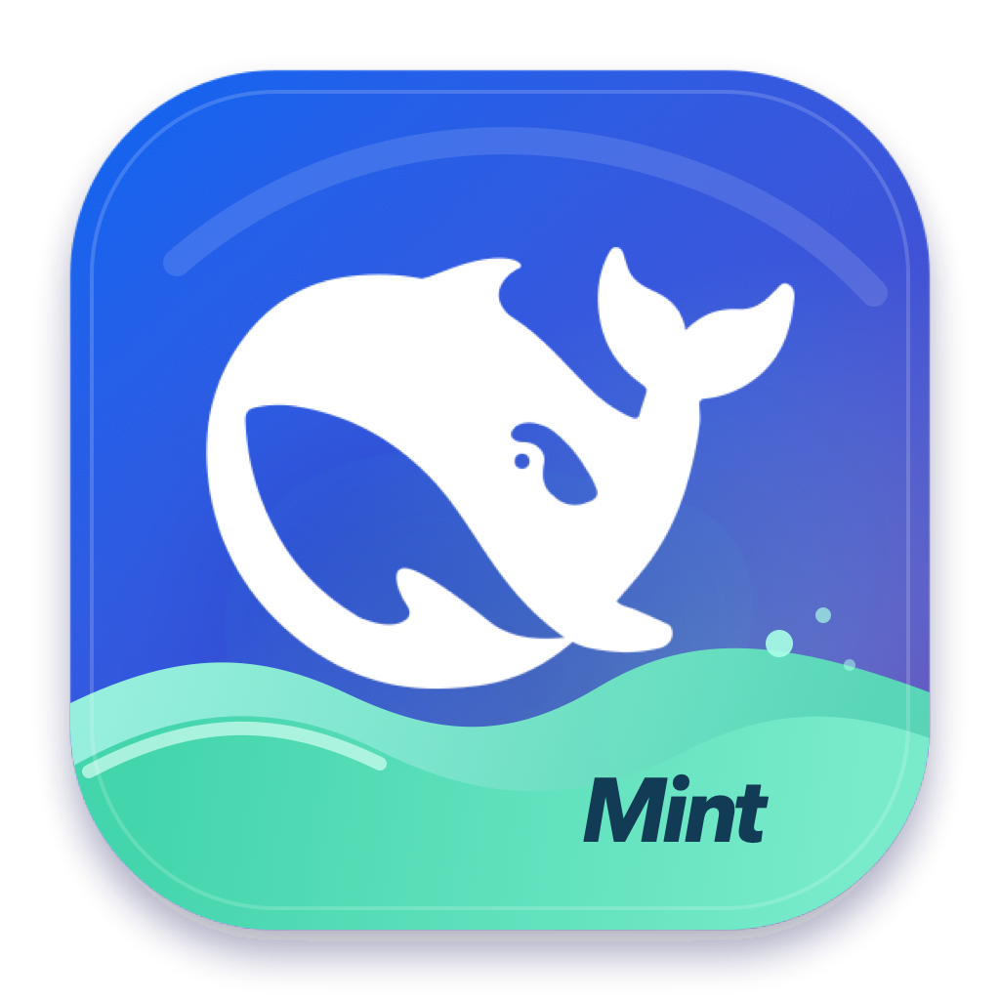

# DSH Desktop Mint

English | [中文](README.zh.md)

DSH Desktop Mint is an unofficial Electron shell for the existing `dsh web` application, maintained by Mint. It does not define another Agent composition or Web client: it supervises the built `@deepseek-ai/dsh` CLI, waits for its canonical loopback readiness line, and loads that URL in a native macOS window.

The name, Mint wave icon, repository identity, and release metadata distinguish this application from an official DeepSeek product. DeepSeek does not endorse, cooperate with, or authorize this distribution.



## Run from source

Install the repository dependencies, then run:

```sh
pnpm run desktop:start
```

The command builds the repository and Electron main process before opening the window. A Finder-style launch has no invoking project directory, so the backend starts in the user's home directory; select or add the intended workspace in the Web UI. DSH data, settings, credentials, profiles, and sessions continue to use the ordinary DSH home, `~/.dsh` by default.

## Build a local macOS application

Build an unsigned Apple Silicon application from the current source tree:

```sh
pnpm run desktop:app:mac
```

Build the Intel application with `pnpm run desktop:app:mac:x64`. Replace `app` with `dmg` in either command to create a local DMG. The default Apple Silicon result is `apps/desktop/dist/mac-arm64/DSH Desktop.app`; electron-builder may use `mac/DSH Desktop.app` for an Intel result.

Each command runs the official client build, packs the current local DSH and vendored packages, installs the selected runtime closure in an isolated resource directory, rejects links that escape that directory, and invokes electron-builder. An unpublished local backend change is therefore included instead of being replaced by the same version from npm.

Local commands disable signing-identity discovery and do not publish a Release. Electron 43 cannot deliver macOS notifications from unsigned or ad-hoc-signed applications, so local output and the pre-certificate public preview cannot validate task notifications or another native capability that depends on stable application identity. Use a Developer ID-signed and notarized artifact for those acceptance tests. Install a local Apple Silicon build for the current user with:

```sh
ditto "apps/desktop/dist/mac-arm64/DSH Desktop.app" "$HOME/Applications/DSH Desktop.app"
```

## Runtime behavior

The Electron main process runs its own executable in Node mode with the packaged CLI and `dsh --profile desktop-mint --no-open --port 0`. That Profile composes `dsh-base`, the shared Web Bundle, and the Mint product Bundle before its user patch. The shell accepts only the official `dsh web: http://127.0.0.1:<port>` readiness line. The startup page remains visible until that line arrives; its Mint ocean scene moves the whale, water, bubbles, and progress current on separate timelines, while reduced-motion preference produces a static whale and progress state. Startup failure or an unexpected backend exit produces a native error dialog. Closing the last window stops the backend with `SIGTERM`, then uses `SIGKILL` after a bounded grace period if required. A second application launch focuses the existing window.

The backend log is `~/Library/Logs/DSH Desktop/backend.log`. External HTTP and HTTPS links open in the system browser. Same-origin application navigation stays inside the DSH window; new windows and all other schemes are denied.

A Developer ID-signed public application lets the Web client send a native macOS notification after a top-level task and all of its subagents stop running. The default **Background only** mode avoids duplicating foreground status; **Settings > General > Task completion notifications** also offers **Off** and **Always**. Clicking the notification opens that task and focuses the existing window. Notification permission remains under macOS control; unsigned local builds cannot deliver this notification.

## Updates

A packaged prerelease such as `0.2.0-preview.1` checks public `mintgao/dsh-desktop` GitHub Releases thirty seconds after startup and every six hours thereafter. It uses an anonymous conditional request, selects the greatest semantic desktop version that contains a DMG for the running Mac architecture, and never downloads code. **DSH Desktop > Check for Updates…** runs the same check on demand.

The first background discovery for a version creates an attention badge and, from a signed application, one native notification. An unsigned preview still exposes the menu and manual check but may not receive the macOS banner. Choosing the notification or **Open Release** opens the exact validated release page and names the recommended arm64 or x64 DMG. **Remind Me Tomorrow** defers one reminder for 24 hours, while **Skip this version** suppresses that version without hiding a later release. These choices and the GitHub ETag live in the application user-data directory; no GitHub credential is stored. Background failures go only to the desktop log, while a manual failure offers the public Releases page.

Prerelease versions use manual installation. Before signing activation their DMGs are unsigned, macOS may require an explicit **Open Anyway** action, and identity-dependent native features are unavailable. Signed prereleases retain the same manual replacement path after activation. The user quits DSH Desktop and replaces the application from the downloaded DMG; settings, credentials, workspaces, and sessions remain in the ordinary DSH home and are not replaced. A preview client can discover a later preview or the first signed stable release through this same manual path. Once that stable application is installed, subsequent updates use the automatic channel described below.

A signed stable application checks the public stable update feed ten seconds after startup and every six hours thereafter. An available version is never downloaded silently. The native dialog offers **Download Update**, **Later**, or **View Release Notes**; the application menu, Dock, and window show download state. After signature-verified download, the user chooses **Restart and Install**, **Install on Quit**, or **Later**. An immediate installation first stops the local DSH backend, and no update forces the application to restart. Source and unpackaged development builds keep the menu command available but explain that public update checks are unavailable.

Each desktop update replaces the complete application, including its tested DSH runtime. Every published upstream Harness release enters the downstream queue automatically. After the exact upstream tag merges and the desktop, build, type, documentation, and source-drift checks pass, the workflow publishes either the default unsigned small-group Pre-release or, after explicit activation, the corresponding signed desktop Release. Publication only makes the version discoverable; preview replacement and stable download or installation remain under user control.

## Security and local data

The renderer is sandboxed with context isolation, Web security, and no Node integration or preload bridge. The backend binds a random loopback port, and the shell never enables a LAN host. The application identifier is `io.github.mintgao.dsh-desktop`.

Credentials and sessions remain under the user's normal environment and DSH home; the desktop shell does not copy them into the application bundle. Follow the root [security policy](../../SECURITY.md) for private vulnerability reporting and supported release artifacts.

## GitHub development

The root [contributor guide](../../CONTRIBUTING.md) defines remotes, branches, cross-device synchronization, dependencies, secrets, upstream updates, and pull requests. `main` stays release-ready, and each device installs its own dependency tree rather than copying architecture-specific output.

[`desktop-ci.yml`](../../.github/workflows/desktop-ci.yml) runs desktop tests, the desktop build, repository type checking, and documentation checks on pull requests and `main`. Its manual package smoke uses native GitHub macOS runners for both arm64 and x64 and loads the packaged Electron main process through the shipped executable before accepting either bundle. Official DeepSeek Harness workflows retain repository guards and do not allocate their organization-specific jobs in this downstream repository.

## Unsigned preview and signed releases

The repository starts in `DESKTOP_RELEASE_SIGNING_MODE=unsigned-preview`. Until the maintainer explicitly confirms Apple Developer readiness and changes that repository variable to `signed`, automated adoption maps `dsh-vX.Y.Z` to `desktop-vX.Y.Z-unsigned.1` and appends `.unsigned.1` to an existing upstream prerelease suffix. The release workflow builds native arm64 and x64 DMGs without discovering a signing identity, verifies that they do not carry a Developer ID Application identity, and publishes them as GitHub Pre-releases with DMGs and SHA-256 checksums only. These artifacts are for personal and small-group manual installation; they never enter the stable updater feed and cannot validate identity-dependent native features.

After the maintainer explicitly confirms that Apple Developer enrollment and release credentials are ready, set `DESKTOP_RELEASE_SIGNING_MODE=signed`. Future automated versions then mirror the adopted Harness Release exactly: `dsh-vX.Y.Z[-suffix]` becomes `desktop-vX.Y.Z[-suffix]`. A prerelease suffix selects signed manual preview DMGs; a stable version additionally publishes signed update ZIPs, blockmaps, combined update metadata, and Latest status. Signed mode requires these encrypted GitHub Actions secrets:

- `MACOS_CERTIFICATE_P12_BASE64` and `MACOS_CERTIFICATE_PASSWORD` for the Developer ID Application certificate.
- `APPLE_API_KEY_P8_BASE64`, `APPLE_API_KEY_ID`, and `APPLE_API_ISSUER` for App Store Connect notarization.

No tag or publication action is required for an ordinary upstream Release. The adoption workflow queues it, updates [the recorded state](../../.github/upstream-sync-state.json), pushes the tag mapped by the active release stage, and dispatches this workflow with the upstream tag and commit for generated Release notes. A manually pushed `desktop-v*` tag remains an exceptional draft-only path.

For an exceptional desktop-only prerelease, create a tag after those credentials are configured:

```sh
git switch main
git pull --ff-only origin main
git tag -s desktop-v0.2.0-preview.1 -m "DSH Desktop Mint 0.2.0 preview 1"
git push origin desktop-v0.2.0-preview.1
```

In signed mode, the workflow forces signing, submits both preview architectures for notarization, verifies their Developer ID identities and stapled tickets, and creates the two DMGs and their SHA-256 checksums. An automated run publishes the GitHub prerelease immediately and records the embedded Harness tag, upstream commit, and desktop source commit. A manual tag creates the same signed artifacts as a draft. Public preview releases become visible to preview clients but never enter `electron-updater`'s stable feed.

For an exceptional desktop-only stable release, create the stable tag after the same credential and artifact checks pass:

```sh
git switch main
git pull --ff-only origin main
git tag -s desktop-v0.1.0 -m "DSH Desktop Mint 0.1.0"
git push origin desktop-v0.1.0
```

For a stable tag, [`desktop-release.yml`](../../.github/workflows/desktop-release.yml) additionally uploads both architecture ZIPs and blockmaps plus one combined `latest-mac.yml` beside the signed DMGs and SHA-256 checksums. Automatic upstream runs publish the Release as Latest; manual tag runs leave it as a draft that installed clients cannot see.

## Withdraw and restore a release

Dispatch [`desktop-release-withdraw.yml`](../../.github/workflows/desktop-release-withdraw.yml) from GitHub Actions, or run:

```sh
gh workflow run desktop-release-withdraw.yml \
  -f release_tag=desktop-vX.Y.Z \
  -f reason='Describe the observed problem'
```

Withdrawal converts the public Release back to a draft without deleting its immutable tag or assets. For a stable release, the workflow also marks the newest remaining public stable release as Latest. It opens or updates a `Desktop release withdrawn: ...` issue containing each withdrawal reason and run, the fallback version, restoration command, and the explicit handoff fact that installed applications are not remotely downgraded. Reinstall an earlier DMG manually when an already-installed copy must roll back. To restore a retained release, publish its draft with `gh release edit desktop-vX.Y.Z --repo mintgao/dsh-desktop --draft=false`; add `--latest` for a stable release.

## Development ownership

[`src/backend.ts`](src/backend.ts) owns readiness parsing and bounded process shutdown. [`src/navigation.ts`](src/navigation.ts) is the pure URL policy. [`src/updates.ts`](src/updates.ts) owns signed update decisions, while [`src/electron-updates.ts`](src/electron-updates.ts) adapts the signed transport. [`src/manual-updates.ts`](src/manual-updates.ts) owns prerelease reminders, [`src/github-releases.ts`](src/github-releases.ts) validates the public Release API, and [`src/manual-update-preferences.ts`](src/manual-update-preferences.ts) stores those choices atomically. [`src/main.ts`](src/main.ts) selects the channel from the application version and owns native presentation. [`../../scripts/prepare-desktop-backend.ts`](../../scripts/prepare-desktop-backend.ts) stages the source-built runtime closure; [`../../scripts/merge-desktop-update-metadata.ts`](../../scripts/merge-desktop-update-metadata.ts) validates and combines signed per-architecture metadata; [`electron-builder.yml`](electron-builder.yml) owns the macOS bundle layout and public feed identity. Run `pnpm run test:desktop` for the focused desktop tests.

The runtime decision and alternatives are recorded in [Electron desktop shell](../../.agents/notes/implemented/feature/2026-08-24-electron-desktop-shell.md). The update lifecycles are recorded in [Manual preview release awareness](../../.agents/notes/implemented/feature/2026-08-24-desktop-manual-preview-updates.md) and [User-controlled signed desktop updates](../../.agents/notes/implemented/feature/2026-08-24-desktop-signed-auto-update.md). The repository model is recorded in [Mint desktop downstream development](../../.agents/notes/implemented/process/2026-08-24-mint-desktop-downstream-development.md), [Pre-certificate unsigned desktop previews](../../.agents/notes/implemented/process/2026-08-27-pre-certificate-unsigned-desktop-previews.md) owns the default trust stage, and [Automatic upstream desktop releases](../../.agents/notes/implemented/process/2026-08-27-automatic-upstream-desktop-releases.md) owns adoption, publication, withdrawal, and cross-Agent records.
